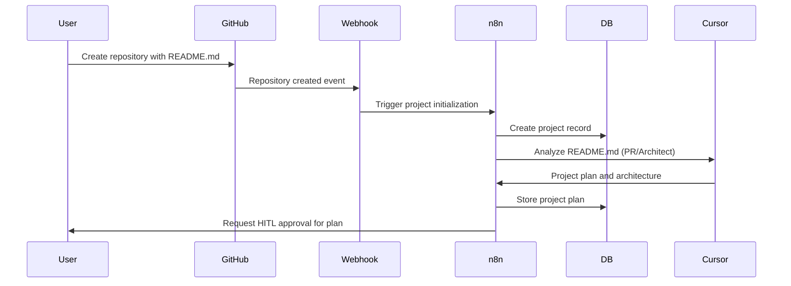
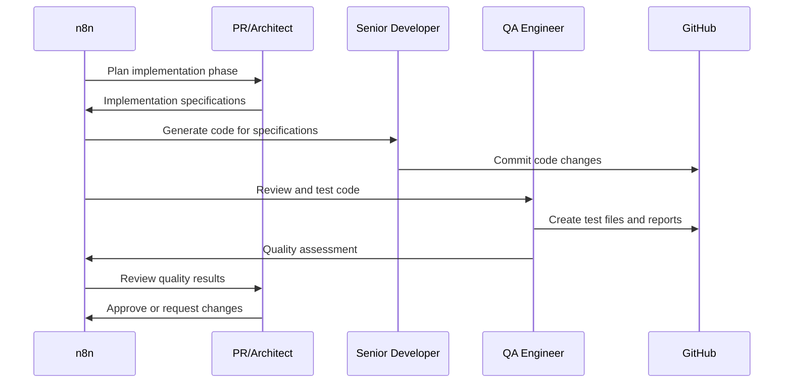
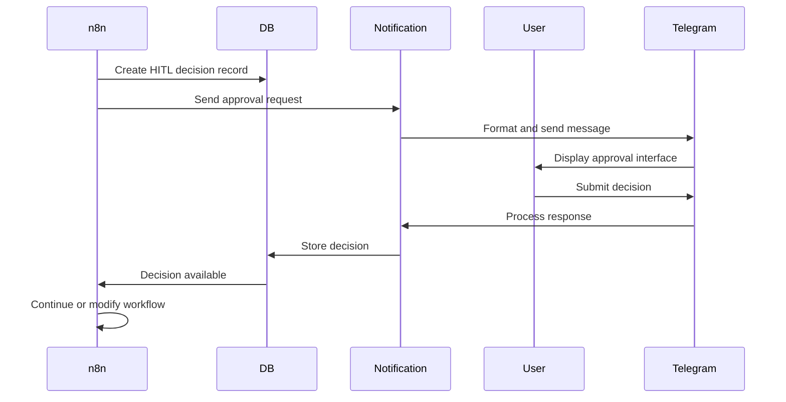
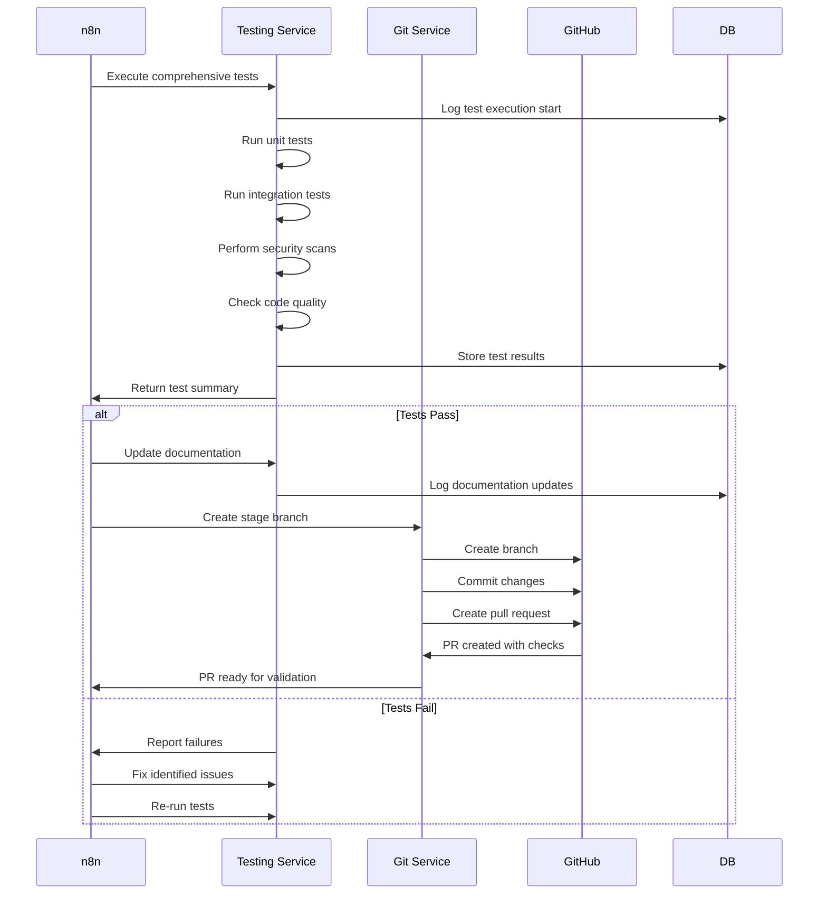
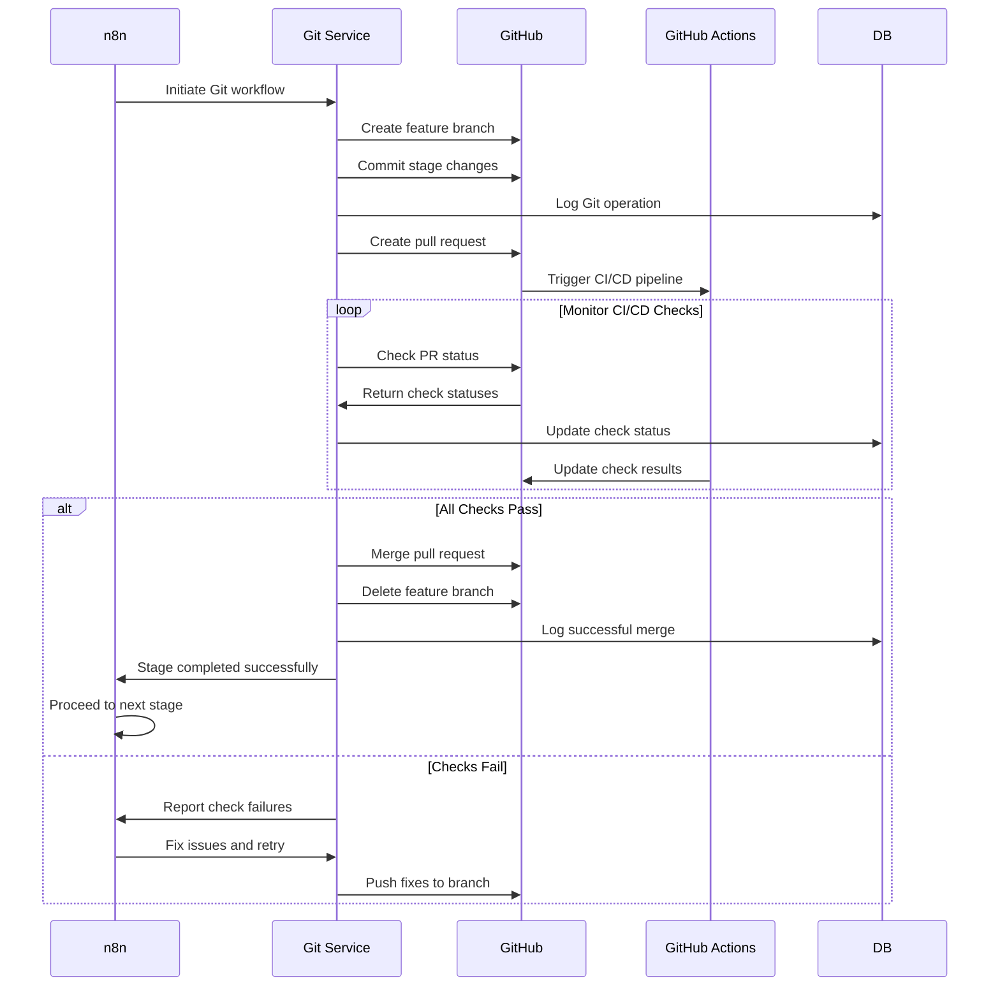

# Architecture

## System Context

QuantaPilot™ operates as a containerized microservices architecture that orchestrates AI agents to
create complete software projects. The system is designed for self-hosted deployment with clear
separation of concerns and scalable components.

**Implementation Status**: Core Infrastructure Complete ✅

- All microservices implemented and containerized
- Database schema and migrations complete
- Monitoring and security infrastructure operational
- n8n workflows configured and ready
- API Gateway with full routing and authentication

## Current System Architecture (Stages 1.1-1.2 Complete)

```mermaid
graph TB
    subgraph "External Interfaces"
        USER[👤 User]
        GITHUB_EXT[📂 GitHub.com]
        TELEGRAM_EXT[📱 Telegram]
        EMAIL_EXT[📧 Email SMTP]
        CURSOR_API[🤖 Cursor API]
    end

    subgraph "Load Balancer / Reverse Proxy"
        LB[🔄 Future: Nginx/Traefik]
    end

    subgraph "API Gateway Layer - Port 3000"
        API[🔌 API Gateway]
        API_AUTH[🔐 JWT Auth]
        API_RATE[⚡ Rate Limiting]
        API_CORS[🌐 CORS Handler]
    end

    subgraph "Microservices Layer"
        CURSOR_SVC[🤖 Cursor Integration<br/>Port 3001]
        GITHUB_SVC[📂 GitHub Integration<br/>Port 3002]
        NOTIFY_SVC[📢 Notification Service<br/>Port 3003]
        DASHBOARD[🌐 Web Dashboard<br/>Port 3004]
        TESTING_SVC[🧪 Testing Service<br/>Port 3006]
        GIT_SVC[🔀 Git Workflow Service<br/>Port 3007]
    end

    subgraph "Orchestration Layer"
        N8N[⚡ n8n Workflows<br/>Port 5678]
        N8N_AUTH[🔐 Basic Auth]
        N8N_WORKFLOWS[📋 Pre-built Workflows]
    end

    subgraph "Data Layer"
        POSTGRES[(🗄️ PostgreSQL<br/>Port 5432)]
        REDIS[(⚡ Redis Cache<br/>Port 6379)]
    end

    subgraph "Monitoring Layer"
        PROMETHEUS[📊 Prometheus<br/>Port 9090]
        GRAFANA[📈 Grafana<br/>Port 3005]
        LOGS[📋 Structured Logs]
    end

    subgraph "Security Layer"
        SECRETS[🔐 Secrets Management]
        ENV_VARS[⚙️ Environment Config]
        VALIDATION[✅ Security Validation]
    end

    USER --> DASHBOARD
    USER --> N8N
    USER --> GRAFANA

    DASHBOARD --> API
    API --> API_AUTH
    API --> API_RATE
    API --> API_CORS

    API --> CURSOR_SVC
    API --> GITHUB_SVC
    API --> NOTIFY_SVC
    API --> TESTING_SVC
    API --> GIT_SVC

    N8N --> N8N_AUTH
    N8N --> N8N_WORKFLOWS
    N8N --> CURSOR_SVC
    N8N --> GITHUB_SVC
    N8N --> NOTIFY_SVC
    N8N --> TESTING_SVC
    N8N --> GIT_SVC
    N8N --> POSTGRES
    N8N --> REDIS

    CURSOR_SVC --> CURSOR_API
    GITHUB_SVC --> GITHUB_EXT
    NOTIFY_SVC --> TELEGRAM_EXT
    NOTIFY_SVC --> EMAIL_EXT

    CURSOR_SVC --> POSTGRES
    GITHUB_SVC --> POSTGRES
    NOTIFY_SVC --> POSTGRES
    TESTING_SVC --> POSTGRES
    GIT_SVC --> POSTGRES

    CURSOR_SVC --> REDIS
    GITHUB_SVC --> REDIS
    NOTIFY_SVC --> REDIS
    TESTING_SVC --> REDIS
    GIT_SVC --> REDIS

    TESTING_SVC --> GITHUB_EXT
    GIT_SVC --> GITHUB_EXT

    PROMETHEUS --> API
    PROMETHEUS --> CURSOR_SVC
    PROMETHEUS --> GITHUB_SVC
    PROMETHEUS --> NOTIFY_SVC
    PROMETHEUS --> TESTING_SVC
    PROMETHEUS --> GIT_SVC
    PROMETHEUS --> POSTGRES
    PROMETHEUS --> REDIS
    PROMETHEUS --> N8N

    GRAFANA --> PROMETHEUS

    SECRETS --> ENV_VARS
    VALIDATION --> SECRETS
```



## Core Components (Implementation Status)

### 1. API Gateway Layer ✅ COMPLETE

#### API Gateway Service (Port 3000)

- **Status**: ✅ Fully Implemented
- **Technology**: Node.js with Express, Docker containerized
- **Current Features**:
  - ✅ Request routing to all microservices
  - ✅ JWT authentication middleware
  - ✅ Rate limiting (configurable per endpoint)
  - ✅ CORS handling
  - ✅ Request correlation IDs
  - ✅ Health check endpoints
  - ✅ Structured logging with Winston
  - ✅ Security headers (Helmet.js)
  - ✅ Graceful shutdown handling

### 2. Microservices Layer ✅ COMPLETE

#### Cursor Integration Service (Port 3001) - Stage 2.1 Enhanced

- **Status**: ✅ Stage 2.1 Complete - Advanced AI Integration
- **Purpose**: Comprehensive AI agent orchestration with intelligent error handling
- **Stage 2.1 Enhancements**:
  - ✅ **Cursor CLI Integration**: Direct CLI wrapper for project workspace management
  - ✅ **Advanced Prompt Management**: Role-based template system with context injection
  - ✅ **Token Budget Enforcement**: Real-time usage tracking with multi-level limits
  - ✅ **Circuit Breaker Pattern**: Intelligent error handling with automatic recovery
  - ✅ **Enhanced Error Categorization**: Smart retry logic based on error types
  - ✅ **Comprehensive Analytics**: Usage reporting and cost optimization
  - ✅ **Project Workspace Management**: Automated Git repository handling
  - ✅ **Performance Monitoring**: Health checks and system metrics

- **Core Features**:
  - ✅ Cursor API integration with authentication
  - ✅ Three AI agent role configurations (Architect, Developer, QA)
  - ✅ Retry logic with exponential backoff
  - ✅ Token usage tracking and optimization
  - ✅ Request/response logging with correlation
  - ✅ Health monitoring and status endpoints
  - ✅ Environment-based configuration

- **Stage 2.1 Components**:
  - ✅ **CursorCLI**: Direct CLI integration for code generation and analysis
  - ✅ **PromptTemplateManager**: Dynamic template system with variable injection
  - ✅ **TokenManager**: Budget enforcement with Redis-based tracking
  - ✅ **CircuitBreaker**: Fault tolerance with intelligent state management
  - ✅ **Enhanced API Endpoints**: Template management, budget monitoring, workspace control

#### GitHub Integration Service (Port 3002)

- **Status**: ✅ Fully Implemented
- **Purpose**: Repository management and webhook handling
- **Current Features**:
  - ✅ Repository analysis and metadata extraction
  - ✅ Branch creation and management
  - ✅ Pull request creation and management
  - ✅ Webhook processing with signature validation
  - ✅ GitHub API rate limiting compliance
  - ✅ Error handling and retry mechanisms

#### Notification Service (Port 3003)

- **Status**: ✅ Fully Implemented
- **Purpose**: Multi-channel notification delivery
- **Current Features**:
  - ✅ Telegram bot integration
  - ✅ Email notifications (SMTP)
  - ✅ Template-based messaging (Handlebars)
  - ✅ Multiple notification types support
  - ✅ Delivery status tracking
  - ✅ Error handling and retries

#### Web Dashboard (Port 3004)

- **Status**: ✅ Fully Implemented
- **Purpose**: React-based management interface
- **Current Features**:
  - ✅ React 18 with Material-UI components
  - ✅ Nginx reverse proxy configuration
  - ✅ Production-optimized Docker build
  - ✅ Health check endpoints
  - ✅ API integration ready

#### Automated Testing Service (Port 3006)

- **Status**: 🆕 New Service for Enhanced Development Workflow
- **Purpose**: Comprehensive testing automation after each development stage
- **Current Features**:
  - 🆕 Multi-framework test execution (Jest, Mocha, Pytest, etc.)
  - 🆕 Code quality analysis with ESLint, SonarQube integration
  - 🆕 Security vulnerability scanning with Snyk, OWASP
  - 🆕 Performance benchmarking and load testing
  - 🆕 Integration test orchestration
  - 🆕 Test result aggregation and reporting
  - 🆕 Automated test failure analysis and recommendations
  - 🆕 Quality gate enforcement before stage progression

#### Git Workflow Service (Port 3007)

- **Status**: 🆕 New Service for Enhanced Development Workflow
- **Purpose**: Automated Git operations and branch management
- **Current Features**:
  - 🆕 Automated stage-specific branch creation
  - 🆕 Intelligent commit message generation with context
  - 🆕 Pull request creation with detailed descriptions
  - 🆕 GitHub Actions CI/CD pipeline monitoring
  - 🆕 Automated PR status checking and validation
  - 🆕 Smart merge strategies with conflict resolution
  - 🆕 Release tagging and version management
  - 🆕 Branch protection rule enforcement

### 3. Orchestration Layer ✅ COMPLETE

#### n8n Workflow Engine (Port 5678)

- **Status**: ✅ Fully Configured
- **Technology**: Self-hosted n8n with PostgreSQL backend
- **Current Features**:
  - ✅ Project lifecycle workflow implemented
  - ✅ HITL decision management workflow
  - ✅ Database integration for state persistence
  - ✅ Service integration endpoints configured
  - ✅ Error handling and timeout management
  - ✅ Basic authentication enabled
  - ✅ Custom workflow templates ready

### 4. Data Layer ✅ COMPLETE

#### PostgreSQL Database (Port 5432)

- **Status**: ✅ Fully Implemented
- **Purpose**: Primary data storage for all project state
- **Current Features**:
  - ✅ Comprehensive schema with 12+ tables
  - ✅ Project lifecycle tracking
  - ✅ AI session and usage logging
  - ✅ HITL decision management
  - ✅ Integration metadata (GitHub, Telegram)
  - ✅ Performance metrics storage
  - ✅ Proper indexing and constraints
  - ✅ Automated migrations and initialization

#### Redis Cache (Port 6379)

- **Status**: ✅ Fully Implemented
- **Purpose**: Caching and session management
- **Current Features**:
  - ✅ Session storage and management
  - ✅ API response caching
  - ✅ Rate limiting data storage
  - ✅ Temporary data caching
  - ✅ Health monitoring

### 5. Monitoring Layer ✅ COMPLETE

#### Prometheus (Port 9090)

- **Status**: ✅ Fully Configured
- **Purpose**: Metrics collection and alerting
- **Current Features**:
  - ✅ All services monitored
  - ✅ Custom QuantaPilot™ metrics
  - ✅ Health check monitoring
  - ✅ Performance metrics tracking
  - ✅ Alert rule configurations ready

#### Grafana (Port 3005)

- **Status**: ✅ Fully Configured
- **Purpose**: Monitoring dashboards and visualization
- **Current Features**:
  - ✅ Pre-built QuantaPilot™ dashboard
  - ✅ Service health visualization
  - ✅ AI token usage tracking
  - ✅ Performance metrics display
  - ✅ Automated datasource provisioning

### 6. Security Layer ✅ COMPLETE

#### Secrets Management

- **Status**: ✅ Fully Implemented
- **Current Features**:
  - ✅ Environment-based configuration
  - ✅ Secure secret generation scripts
  - ✅ Security validation automation
  - ✅ Docker secrets integration ready
  - ✅ .gitignore protection for secrets

#### Container Security

- **Status**: ✅ Fully Implemented
- **Current Features**:
  - ✅ Non-root user execution in all containers
  - ✅ Minimal Alpine Linux base images
  - ✅ Security header implementation
  - ✅ Network isolation with Docker networks
  - ✅ Health check implementations

### 7. AI Agent Layer 🚧 NEXT PHASE (Stage 1.3)

#### Future Cursor Integration Features

- **Status**: 🚧 Infrastructure Ready, Agents Pending
- **Planned Features**:
  - AI agent role implementations
  - Prompt template management
  - Context preservation systems
  - Advanced retry and error handling
  - Documentation compliance enforcement
- **Technology**: Node.js service with Cursor CLI integration
- **Responsibilities**:
  - Prompt template management with documentation compliance enforcement
  - Token usage tracking and optimization
  - Response parsing and validation
  - Error handling and retry logic
  - Context preservation across interactions
  - Project-specific .cursor/rules generation based on technology stack
  - Documentation structure template creation and validation
  - Compliance checking and enforcement for generated projects

### 8. Testing and Quality Assurance Layer 🆕 NEW ADDITION

#### Automated Testing Service (Port 3006)

- **Status**: 🆕 New Component for Enhanced Development Workflow
- **Purpose**: Comprehensive testing automation after each development stage
- **Technology**: Node.js service with multiple testing framework support
- **Current Features**:
  - Automated test execution for generated projects
  - Multi-framework test support (Jest, Mocha, Pytest, etc.)
  - Code quality analysis and reporting
  - Security vulnerability scanning
  - Performance testing and benchmarking
  - Integration test orchestration
  - Test result aggregation and reporting
  - Test failure analysis and recommendations

#### Quality Gate Management

- **Status**: 🆕 New Component
- **Purpose**: Enforce quality standards before stage progression
- **Responsibilities**:
  - Define quality criteria for each development stage
  - Execute comprehensive test suites
  - Perform static code analysis
  - Validate documentation completeness
  - Check security compliance
  - Verify performance benchmarks
  - Generate quality reports
  - Block progression on quality failures

### 9. Git Workflow Management Layer 🆕 NEW ADDITION

#### Git Integration Service (Port 3007)

- **Status**: 🆕 New Component for Enhanced Development Workflow
- **Purpose**: Automated Git operations and branch management
- **Technology**: Node.js service with Git CLI and GitHub API integration
- **Current Features**:
  - Automated branch creation for each development stage
  - Intelligent commit message generation
  - Pull request creation and management
  - GitHub Actions CI/CD integration
  - Merge conflict resolution assistance
  - Branch protection rule enforcement
  - Code review automation
  - Release management and tagging

#### Git Workflow Orchestration

- **Status**: 🆕 New Component
- **Purpose**: Manage development workflow through Git operations
- **Responsibilities**:
  - Create stage-specific branches (feature/stage-{number}-{description})
  - Generate comprehensive commit messages with stage progress
  - Create pull requests with detailed descriptions and context
  - Monitor GitHub Actions and CI/CD pipeline status
  - Ensure all checks pass before merging
  - Automatic PR merging upon successful validation
  - Tag releases and manage version control
  - Maintain clean Git history and branch structure

#### AI Agent Roles

##### PR/Architect Agent

- **Responsibilities**:
  - Project requirements analysis and documentation structure creation
  - Technology stack selection with .cursor/rules generation
  - Architecture design and comprehensive documentation generation
  - Project-specific .cursor/rules creation based on tech stack and requirements
  - Project planning and milestone definition with documentation compliance checkpoints
  - Code review and quality oversight with documentation validation
  - Documentation compliance framework establishment for generated projects

##### Senior Developer Agent

- **Responsibilities**:
  - Code implementation following project-specific .cursor/rules
  - Best practices enforcement per generated documentation standards
  - Module and component creation with comprehensive documentation
  - Automatic documentation generation and maintenance with every code change
  - API documentation updates synchronized with implementation
  - Dependency management with documentation updates
  - Inline code documentation following established patterns from .cursor/rules

##### QA Engineer Agent

- **Responsibilities**:
  - Test strategy development with documentation validation
  - Unit, integration, and e2e test creation with comprehensive documentation
  - Bug identification and reporting with documentation updates
  - Quality metrics collection including documentation completeness
  - Performance and security validation with documentation
  - Documentation accuracy validation and link checking
  - Compliance verification with project .cursor/rules and standards

### 3. Data Layer

#### PostgreSQL Database

- **Purpose**: Persistent storage for project state and metadata
- **Schema Design**:

  ```sql
  -- Projects table
  CREATE TABLE projects (
    id UUID PRIMARY KEY,
    repository_url VARCHAR(255) NOT NULL,
    status VARCHAR(50) NOT NULL,
    current_stage VARCHAR(100),
    created_at TIMESTAMP DEFAULT NOW(),
    updated_at TIMESTAMP DEFAULT NOW(),
    config JSONB,
    metadata JSONB
  );

  -- Project stages tracking
  CREATE TABLE project_stages (
    id UUID PRIMARY KEY,
    project_id UUID REFERENCES projects(id),
    stage_name VARCHAR(100) NOT NULL,
    status VARCHAR(50) NOT NULL,
    started_at TIMESTAMP,
    completed_at TIMESTAMP,
    ai_agent VARCHAR(50),
    tokens_used INTEGER,
    artifacts JSONB
  );

  -- HITL decisions
  CREATE TABLE hitl_decisions (
    id UUID PRIMARY KEY,
    project_id UUID REFERENCES projects(id),
    stage_id UUID REFERENCES project_stages(id),
    decision_type VARCHAR(100) NOT NULL,
    context JSONB NOT NULL,
    status VARCHAR(50) DEFAULT 'pending',
    decision JSONB,
    decided_by VARCHAR(255),
    decided_at TIMESTAMP
  );

  -- Testing results
  CREATE TABLE test_executions (
    id UUID PRIMARY KEY,
    project_id UUID REFERENCES projects(id),
    stage_id UUID REFERENCES project_stages(id),
    test_type VARCHAR(50) NOT NULL,
    framework VARCHAR(50),
    status VARCHAR(50) NOT NULL,
    started_at TIMESTAMP DEFAULT NOW(),
    completed_at TIMESTAMP,
    duration_ms INTEGER,
    passed_tests INTEGER DEFAULT 0,
    failed_tests INTEGER DEFAULT 0,
    skipped_tests INTEGER DEFAULT 0,
    coverage_percentage DECIMAL(5,2),
    results JSONB,
    error_details JSONB
  );

  -- Quality gates
  CREATE TABLE quality_gates (
    id UUID PRIMARY KEY,
    project_id UUID REFERENCES projects(id),
    stage_id UUID REFERENCES project_stages(id),
    gate_type VARCHAR(50) NOT NULL,
    criteria JSONB NOT NULL,
    status VARCHAR(50) NOT NULL,
    score DECIMAL(5,2),
    passed BOOLEAN DEFAULT FALSE,
    evaluated_at TIMESTAMP DEFAULT NOW(),
    details JSONB
  );

  -- Git operations
  CREATE TABLE git_operations (
    id UUID PRIMARY KEY,
    project_id UUID REFERENCES projects(id),
    stage_id UUID REFERENCES project_stages(id),
    operation_type VARCHAR(50) NOT NULL,
    branch_name VARCHAR(255),
    commit_hash VARCHAR(40),
    pr_number INTEGER,
    pr_url VARCHAR(500),
    status VARCHAR(50) NOT NULL,
    started_at TIMESTAMP DEFAULT NOW(),
    completed_at TIMESTAMP,
    metadata JSONB
  );

  -- GitHub CI/CD checks
  CREATE TABLE github_checks (
    id UUID PRIMARY KEY,
    git_operation_id UUID REFERENCES git_operations(id),
    check_name VARCHAR(255) NOT NULL,
    status VARCHAR(50) NOT NULL,
    conclusion VARCHAR(50),
    started_at TIMESTAMP,
    completed_at TIMESTAMP,
    details_url VARCHAR(500),
    output JSONB
  );
  ```

#### Redis Cache

- **Purpose**: High-performance caching and session management
- **Use Cases**:
  - AI response caching
  - Session state management
  - Rate limiting counters
  - Real-time progress tracking
  - Temporary data storage

### 4. Integration Layer

#### GitHub Integration Service

- **Purpose**: Repository and issue management automation
- **Capabilities**:
  - Repository creation and configuration
  - Branch and PR management
  - Issue creation and tracking
  - Webhook event processing
  - Code commit and push operations

#### Notification Service

- **Purpose**: Multi-channel communication and HITL coordination
- **Channels**:
  - Telegram bot for real-time notifications
  - Email for formal communications
  - Web dashboard for detailed reviews
  - Webhook callbacks for external systems

## Data Flow Architecture

### 1. Project Initialization Flow



### 2. Development Workflow



### 3. HITL Decision Flow



### 4. Testing and Quality Assurance Flow



### 5. Git Workflow and CI/CD Integration Flow



## Deployment Architecture

### Container Structure

```yaml
version: '3.8'
services:
  # Orchestration
  n8n:
    image: n8nio/n8n:latest
    environment:
      - DB_TYPE=postgresdb
      - DB_POSTGRESDB_HOST=postgres
    depends_on:
      - postgres
      - redis

  # API Gateway
  api-gateway:
    build: ./services/api-gateway
    environment:
      - NODE_ENV=production
      - DATABASE_URL=postgresql://...
    depends_on:
      - postgres

  # AI Integration
  cursor-service:
    build: ./services/cursor-integration
    environment:
      - CURSOR_API_KEY=${CURSOR_API_KEY}
      - NODE_ENV=production

  # Data Layer
  postgres:
    image: postgres:15
    environment:
      - POSTGRES_DB=quantapilot
      - POSTGRES_USER=${POSTGRES_USER}
      - POSTGRES_PASSWORD=${POSTGRES_PASSWORD}
    volumes:
      - postgres_data:/var/lib/postgresql/data

  redis:
    image: redis:7-alpine
    volumes:
      - redis_data:/data

  # Integration Services
  github-service:
    build: ./services/github-integration
    environment:
      - GITHUB_TOKEN=${GITHUB_TOKEN}
      - NODE_ENV=production

  notification-service:
    build: ./services/notifications
    environment:
      - TELEGRAM_BOT_TOKEN=${TELEGRAM_BOT_TOKEN}
      - NODE_ENV=production

  # Testing and Quality Assurance
  testing-service:
    build: ./services/testing
    environment:
      - NODE_ENV=production
      - DATABASE_URL=${DATABASE_URL}
      - REDIS_URL=${REDIS_URL}
      - SONARQUBE_URL=${SONARQUBE_URL}
      - SNYK_TOKEN=${SNYK_TOKEN}
    volumes:
      - /var/run/docker.sock:/var/run/docker.sock
      - ./test-results:/app/test-results

  # Git Workflow Management
  git-workflow-service:
    build: ./services/git-workflow
    environment:
      - NODE_ENV=production
      - DATABASE_URL=${DATABASE_URL}
      - REDIS_URL=${REDIS_URL}
      - GITHUB_TOKEN=${GITHUB_TOKEN}
      - GIT_USER_NAME=${GIT_USER_NAME}
      - GIT_USER_EMAIL=${GIT_USER_EMAIL}
```

### Network Architecture

- **Internal Network**: Container-to-container communication
- **External Access**: Only API Gateway and n8n dashboard exposed
- **Security Groups**: Restricted access based on service requirements
- **Load Balancing**: NGINX for production deployments

## Security Architecture

### Authentication & Authorization

- **API Gateway**: JWT-based authentication
- **n8n Access**: Basic auth with strong passwords
- **Service-to-Service**: Internal network isolation
- **External APIs**: Secure token management

### Data Protection

- **Encryption at Rest**: PostgreSQL with encryption
- **Encryption in Transit**: TLS for all external communications
- **Secrets Management**: Environment variables and Docker secrets
- **Data Anonymization**: PII scrubbing in logs and metrics

### Network Security

- **Container Isolation**: No direct external access to internal services
- **Firewall Rules**: Restricted port access
- **VPN Access**: Optional VPN for administrative access
- **Security Scanning**: Regular vulnerability assessments

## Scalability Considerations

### Horizontal Scaling

- **Stateless Services**: API Gateway and integration services
- **Database Clustering**: PostgreSQL read replicas
- **Cache Distribution**: Redis cluster for high availability
- **Load Distribution**: Multiple n8n instances with work distribution

### Vertical Scaling

- **CPU Optimization**: AI workload optimization
- **Memory Management**: Efficient caching strategies
- **Storage Performance**: SSD storage for database and cache
- **Network Bandwidth**: Optimized for API-heavy workloads

## Monitoring & Observability

### Metrics Collection

- **Application Metrics**: Custom business metrics
- **Infrastructure Metrics**: Container and host monitoring
- **Performance Metrics**: Response times and throughput
- **Error Tracking**: Comprehensive error logging and alerting

### Logging Strategy

- **Structured Logging**: JSON format with correlation IDs
- **Centralized Collection**: ELK stack or similar
- **Log Retention**: Configurable retention policies
- **Security Logging**: Audit trail for all actions

### Health Checks

- **Service Health**: Individual service health endpoints
- **Database Health**: Connection and query performance
- **External Dependencies**: GitHub and Cursor API availability
- **End-to-End Health**: Complete workflow validation

## Technology Stack Summary

| Component            | Technology              | Purpose                                    |
| -------------------- | ----------------------- | ------------------------------------------ |
| **Orchestration**    | n8n                     | Workflow automation and process management |
| **AI Integration**   | Cursor CLI/API          | Code generation and AI agent interaction   |
| **API Gateway**      | Node.js + Express       | Request routing and API management         |
| **Database**         | PostgreSQL              | Persistent data storage                    |
| **Cache**            | Redis                   | High-performance caching                   |
| **Containerization** | Docker + Docker Compose | Service isolation and deployment           |
| **Web Framework**    | React                   | Dashboard and UI components                |
| **Message Queue**    | Redis Pub/Sub           | Asynchronous communication                 |
| **Monitoring**       | Prometheus + Grafana    | Metrics and alerting                       |
| **Logging**          | Winston + ELK Stack     | Structured logging and analysis            |
| **Testing**          | Jest + Mocha + PyTest   | Multi-framework testing automation         |
| **Quality Analysis** | ESLint + SonarQube      | Code quality and security scanning         |
| **Git Operations**   | Git CLI + GitHub API    | Automated Git workflow management          |
