# Architecture

## System Context

QuantaPilot™ operates as a containerized microservices architecture that orchestrates AI agents to create complete software projects. The system is designed for self-hosted deployment with clear separation of concerns and scalable components.

```mermaid
graph TB
    User[👤 User] --> TG[📱 Telegram Bot]
    User --> WEB[🌐 Web Dashboard]
    User --> GH[📂 GitHub Repository]
    
    TG --> API[🔌 API Gateway]
    WEB --> API
    GH --> WEBHOOK[🔔 GitHub Webhooks]
    
    API --> N8N[⚡ n8n Orchestrator]
    WEBHOOK --> N8N
    
    N8N --> CURSOR[🤖 Cursor AI Agents]
    N8N --> DB[(🗄️ PostgreSQL)]
    N8N --> REDIS[(⚡ Redis Cache)]
    
    CURSOR --> PR[👨‍💼 PR/Architect]
    CURSOR --> DEV[👨‍💻 Senior Developer]
    CURSOR --> QA[🧪 QA Engineer]
    
    PR --> GITHUB[📂 GitHub API]
    DEV --> GITHUB
    QA --> GITHUB
    
    N8N --> NOTIFY[📢 Notification Service]
    NOTIFY --> TG
    NOTIFY --> EMAIL[📧 Email Service]
```



## Core Components

### 1. Orchestration Layer

#### n8n Workflow Engine
- **Purpose**: Central orchestration of all development processes
- **Technology**: Self-hosted n8n instance
- **Responsibilities**:
  - Project lifecycle management
  - AI agent coordination
  - State machine implementation
  - Error handling and recovery
  - HITL decision routing

#### API Gateway
- **Purpose**: Unified entry point for external interactions
- **Technology**: Node.js with Express
- **Responsibilities**:
  - Request routing and validation
  - Authentication and authorization
  - Rate limiting and throttling
  - Request/response logging
  - API versioning

### 2. AI Agent Layer

#### Cursor Integration Service
- **Purpose**: Interface between n8n and Cursor AI with documentation compliance enforcement
- **Technology**: Node.js service with Cursor CLI integration
- **Responsibilities**:
  - Prompt template management with documentation compliance enforcement
  - Token usage tracking and optimization
  - Response parsing and validation
  - Error handling and retry logic
  - Context preservation across interactions
  - Project-specific .cursor/rules generation based on technology stack
  - Documentation structure template creation and validation
  - Compliance checking and enforcement for generated projects

#### AI Agent Roles

##### PR/Architect Agent
- **Responsibilities**:
  - Project requirements analysis and documentation structure creation
  - Technology stack selection with .cursor/rules generation
  - Architecture design and comprehensive documentation generation
  - Project-specific .cursor/rules creation based on tech stack and requirements
  - Project planning and milestone definition with documentation compliance checkpoints
  - Code review and quality oversight with documentation validation
  - Documentation compliance framework establishment for generated projects

##### Senior Developer Agent
- **Responsibilities**:
  - Code implementation following project-specific .cursor/rules
  - Best practices enforcement per generated documentation standards
  - Module and component creation with comprehensive documentation
  - Automatic documentation generation and maintenance with every code change
  - API documentation updates synchronized with implementation
  - Dependency management with documentation updates
  - Inline code documentation following established patterns from .cursor/rules

##### QA Engineer Agent
- **Responsibilities**:
  - Test strategy development with documentation validation
  - Unit, integration, and e2e test creation with comprehensive documentation
  - Bug identification and reporting with documentation updates
  - Quality metrics collection including documentation completeness
  - Performance and security validation with documentation
  - Documentation accuracy validation and link checking
  - Compliance verification with project .cursor/rules and standards

### 3. Data Layer

#### PostgreSQL Database
- **Purpose**: Persistent storage for project state and metadata
- **Schema Design**:
  ```sql
  -- Projects table
  CREATE TABLE projects (
    id UUID PRIMARY KEY,
    repository_url VARCHAR(255) NOT NULL,
    status VARCHAR(50) NOT NULL,
    current_stage VARCHAR(100),
    created_at TIMESTAMP DEFAULT NOW(),
    updated_at TIMESTAMP DEFAULT NOW(),
    config JSONB,
    metadata JSONB
  );
  
  -- Project stages tracking
  CREATE TABLE project_stages (
    id UUID PRIMARY KEY,
    project_id UUID REFERENCES projects(id),
    stage_name VARCHAR(100) NOT NULL,
    status VARCHAR(50) NOT NULL,
    started_at TIMESTAMP,
    completed_at TIMESTAMP,
    ai_agent VARCHAR(50),
    tokens_used INTEGER,
    artifacts JSONB
  );
  
  -- HITL decisions
  CREATE TABLE hitl_decisions (
    id UUID PRIMARY KEY,
    project_id UUID REFERENCES projects(id),
    stage_id UUID REFERENCES project_stages(id),
    decision_type VARCHAR(100) NOT NULL,
    context JSONB NOT NULL,
    status VARCHAR(50) DEFAULT 'pending',
    decision JSONB,
    decided_by VARCHAR(255),
    decided_at TIMESTAMP
  );
  ```

#### Redis Cache
- **Purpose**: High-performance caching and session management
- **Use Cases**:
  - AI response caching
  - Session state management
  - Rate limiting counters
  - Real-time progress tracking
  - Temporary data storage

### 4. Integration Layer

#### GitHub Integration Service
- **Purpose**: Repository and issue management automation
- **Capabilities**:
  - Repository creation and configuration
  - Branch and PR management
  - Issue creation and tracking
  - Webhook event processing
  - Code commit and push operations

#### Notification Service
- **Purpose**: Multi-channel communication and HITL coordination
- **Channels**:
  - Telegram bot for real-time notifications
  - Email for formal communications
  - Web dashboard for detailed reviews
  - Webhook callbacks for external systems

## Data Flow Architecture

### 1. Project Initialization Flow


### 2. Development Workflow


### 3. HITL Decision Flow


## Deployment Architecture

### Container Structure
```yaml
version: '3.8'
services:
  # Orchestration
  n8n:
    image: n8nio/n8n:latest
    environment:
      - DB_TYPE=postgresdb
      - DB_POSTGRESDB_HOST=postgres
    depends_on:
      - postgres
      - redis
    
  # API Gateway
  api-gateway:
    build: ./services/api-gateway
    environment:
      - NODE_ENV=production
      - DATABASE_URL=postgresql://...
    depends_on:
      - postgres
    
  # AI Integration
  cursor-service:
    build: ./services/cursor-integration
    environment:
      - CURSOR_API_KEY=${CURSOR_API_KEY}
      - NODE_ENV=production
    
  # Data Layer
  postgres:
    image: postgres:15
    environment:
      - POSTGRES_DB=quantapilot
      - POSTGRES_USER=${POSTGRES_USER}
      - POSTGRES_PASSWORD=${POSTGRES_PASSWORD}
    volumes:
      - postgres_data:/var/lib/postgresql/data
    
  redis:
    image: redis:7-alpine
    volumes:
      - redis_data:/data
    
  # Integration Services
  github-service:
    build: ./services/github-integration
    environment:
      - GITHUB_TOKEN=${GITHUB_TOKEN}
      - NODE_ENV=production
    
  notification-service:
    build: ./services/notifications
    environment:
      - TELEGRAM_BOT_TOKEN=${TELEGRAM_BOT_TOKEN}
      - NODE_ENV=production
```

### Network Architecture
- **Internal Network**: Container-to-container communication
- **External Access**: Only API Gateway and n8n dashboard exposed
- **Security Groups**: Restricted access based on service requirements
- **Load Balancing**: NGINX for production deployments

## Security Architecture

### Authentication & Authorization
- **API Gateway**: JWT-based authentication
- **n8n Access**: Basic auth with strong passwords
- **Service-to-Service**: Internal network isolation
- **External APIs**: Secure token management

### Data Protection
- **Encryption at Rest**: PostgreSQL with encryption
- **Encryption in Transit**: TLS for all external communications
- **Secrets Management**: Environment variables and Docker secrets
- **Data Anonymization**: PII scrubbing in logs and metrics

### Network Security
- **Container Isolation**: No direct external access to internal services
- **Firewall Rules**: Restricted port access
- **VPN Access**: Optional VPN for administrative access
- **Security Scanning**: Regular vulnerability assessments

## Scalability Considerations

### Horizontal Scaling
- **Stateless Services**: API Gateway and integration services
- **Database Clustering**: PostgreSQL read replicas
- **Cache Distribution**: Redis cluster for high availability
- **Load Distribution**: Multiple n8n instances with work distribution

### Vertical Scaling
- **CPU Optimization**: AI workload optimization
- **Memory Management**: Efficient caching strategies
- **Storage Performance**: SSD storage for database and cache
- **Network Bandwidth**: Optimized for API-heavy workloads

## Monitoring & Observability

### Metrics Collection
- **Application Metrics**: Custom business metrics
- **Infrastructure Metrics**: Container and host monitoring
- **Performance Metrics**: Response times and throughput
- **Error Tracking**: Comprehensive error logging and alerting

### Logging Strategy
- **Structured Logging**: JSON format with correlation IDs
- **Centralized Collection**: ELK stack or similar
- **Log Retention**: Configurable retention policies
- **Security Logging**: Audit trail for all actions

### Health Checks
- **Service Health**: Individual service health endpoints
- **Database Health**: Connection and query performance
- **External Dependencies**: GitHub and Cursor API availability
- **End-to-End Health**: Complete workflow validation

## Technology Stack Summary

| Component | Technology | Purpose |
|-----------|------------|---------|
| **Orchestration** | n8n | Workflow automation and process management |
| **AI Integration** | Cursor CLI/API | Code generation and AI agent interaction |
| **API Gateway** | Node.js + Express | Request routing and API management |
| **Database** | PostgreSQL | Persistent data storage |
| **Cache** | Redis | High-performance caching |
| **Containerization** | Docker + Docker Compose | Service isolation and deployment |
| **Web Framework** | React | Dashboard and UI components |
| **Message Queue** | Redis Pub/Sub | Asynchronous communication |
| **Monitoring** | Prometheus + Grafana | Metrics and alerting |
| **Logging** | Winston + ELK Stack | Structured logging and analysis |
